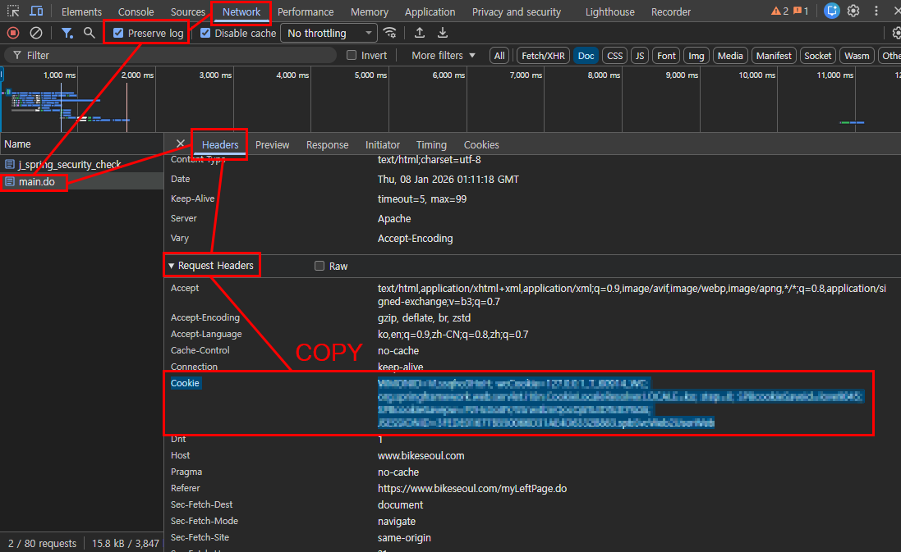

# 따릉이 (Seoul Public Bike)

이 커스텀 통합구성요소는 서울시 공공자전거 따릉이 정보를 Home Assistant에서 손쉽게 조회할 수 있도록 해 줍니다. 하나의 통합에서 **두 가지 데이터 수집 방식**을 제공하며, 사용자의 취향과 필요에 따라 선택할 수 있습니다.

- **API 방식 (OpenAPI Polling)** – [서울 열린데이터광장](https://data.seoul.go.kr/together/mypage/actkeyMng_ss.do)의 OpenAPI를 주기적으로 호출하여 모든 대여소의 실시간 잔여 자전거 정보를 가져옵니다.
- **Cookie 방식 (Web Pulling)** – [따릉이](https://www.bikeseoul.com)에 로그인한 브라우저의 쿠키를 이용해 **개인 이용내역**과 **즐겨찾는 대여소 현황**을 직접 수집합니다.

---

## 설치 (HACS)

아래 버튼을 누르면, Home Assistant에서 HACS 커스텀 레포 추가 화면으로 이동합니다.

[](https://my.home-assistant.io/redirect/hacs_repository/?owner=1bobby-git&repository=HA-Seoul-Bike&category=integration)

1. HACS → **Integrations** → 우측 상단 ⋮ → **Custom repositories**
2. Repository: `https://github.com/1bobby-git/HA-Seoul-Bike`
3. Category: **Integration**
4. 설치 후 Home Assistant 재시작

---

## 설정(추가) 흐름

통합 추가 화면으로 바로 이동하는 버튼입니다.

[](https://my.home-assistant.io/redirect/config_flow_start/?domain=seoul_bike)

통합을 추가하면 **수집 방식**을 먼저 선택합니다.

### 1) API 방식 – OpenAPI Polling

이 모드는 서울 열린데이터광장의 [따릉이 대여소 API](https://data.seoul.go.kr/dataList/OA-15493/A/1/datasetView.do)를 주기적으로 호출하여 전체 대여소의 데이터를 가져옵니다.

**입력 항목**

- **OpenAPI 키** – 서울 열린데이터광장에서 발급 받은 인증키를 입력합니다.
- **내 위치 엔티티 (entity_id)** – 추천 대여소를 계산할 때 기준이 되는 위치(예: `person.홍길동` 또는 `device_tracker.my_phone`). Home Assistant의 위치 기반 엔티티를 지정해야 합니다.
- **업데이트 주기(초)** – API를 호출하는 간격을 초 단위로 지정합니다. 기본값은 소스 코드에서 정의된 값(예: 30 초)이며 너무 짧게 설정하면 API 호출 한도에 걸릴 수 있습니다.
- **정류소 목록** – 쉼표 또는 줄바꿈으로 구분된 대여소 번호 또는 코드(ST-0000). 번호만 입력하면 내부에서 ST‑코드를 자동으로 찾아서 매핑합니다. 여러 후보가 있을 경우 모호함을 피하기 위해 전체 코드를 입력하는 것을 권장합니다.

**주요 기능**

- **반경 내 잔여 자전거 합계 및 추천 대여소 센서** – 설정한 위치를 기준으로 지정 반경 안에 있는 대여소들의 잔여 자전거 수를 모두 더한 센서를 생성합니다. 동시에 최소 대여가능 자전거 수를 만족하는 가장 가까운 대여소를 찾아 “추천 대여소” 센서로 제공합니다. 이 센서는 추천 대여소의 ID, 이름, 거리, 잔여 자전거 수 등을 추가 속성으로 포함합니다.
- **정류소별 센서 자동 생성** – 설정한 정류소 목록에 따라 각 대여소별 센서를 생성합니다. 각 대여소에 대해 전체 잔여 자전거 수뿐 아니라 **일반 자전거**, **새싹 자전거**, **수리 중인 자전거** 등의 개별 수량 센서가 함께 생성되며, 위치와 거리를 속성으로 제공합니다.
- **정류소 목록 센서** – 입력한 정류소 목록을 하나의 문자열로 보여주는 센서가 생성되어 대시보드에서 쉽게 확인할 수 있습니다.
- **새로고침 버튼** – Home Assistant UI에 버튼 엔티티가 등록되어 API를 즉시 호출하도록 강제할 수 있습니다. 전체 대여소 갱신 버튼과 개별 대여소 갱신 버튼이 제공됩니다.
- **지능형 매칭** – 정류소 번호만 입력하면 내부적으로 ST‑코드로 변환하여 매핑합니다. 다수의 후보가 존재하면 모호하다는 알림을 보내며 전체 코드를 입력하도록 안내합니다.
- **코디네이터 기반 캐싱** – `SeoulBikeCoordinator`가 내부적으로 모든 API 호출을 관리하고 데이터를 캐시하여 다수의 센서가 효율적으로 동작합니다.

**테스트 예시**

```bash
curl -m 25 -v "http://openapi.seoul.go.kr:8088/내키/json/bikeList/1/5/"
```

### 2) Cookie 방식 – Web Pulling

이 모드는 여러분의 따릉이 계정으로 로그인한 브라우저의 **세션 쿠키**를 사용하여 대여/반납 이력과 즐겨찾는 대여소 정보를 직접 수집합니다. 로그인을 유지한 상태의 쿠키가 필요하며, 만료되면 새로운 쿠키로 교체해야 합니다.

**입력 항목**

- **따릉이 로그인 쿠키** – 크롬/파이어폭스 개발자 도구의 Network 탭에서 `bikeseoul.com` 요청의 `Cookie` 값을 복사하여 입력합니다.

**주요 기능**

- **이용내역(대여/반납) 센서** – 최근 대여·반납 기록을 수집하여 센서로 제공합니다. 마지막 기록의 자전거 번호, 출발 대여소, 도착 대여소, 이용 시간, 이동 거리 등이 각각의 센서에 표시됩니다.
- **운동/환경 지표 센서** – 따릉이 마이페이지의 ‘kcal box’에 있는 정보(탄소 절감량, 소모 칼로리, 총 이용 거리, 총 이용 시간, 누적 이용 횟수 등)를 파싱하여 텍스트 센서와 숫자 센서로 제공합니다. 예를 들어 “탄소 절감” 센서에는 “123 kg”와 같은 문자열과 함께 123이라는 숫자 속성이 포함됩니다.
- **정기권 만료일 센서** – 여러분의 대여권/정기권의 만료일을 별도 센서로 표시하여 티켓 갱신 시기를 미리 확인할 수 있습니다.
- **즐겨찾는 대여소 센서** – 즐겨찾기로 지정한 대여소 목록을 가져와 **동적으로** 센서를 생성합니다. 각 즐겨찾기 대여소에 대해 일반 자전거 잔여 수, 새싹 자전거 잔여 수를 개별 센서로 제공합니다. 즐겨찾기 목록을 웹사이트에서 변경하면 다음 새로고침 시 센서가 자동으로 추가·삭제되어 대시보드에 반영됩니다.
- **마지막 업데이트 시간 센서** – 데이터가 마지막으로 갱신된 시각을 표시하는 센서가 포함되어 쿠키가 유효한지 확인할 수 있습니다.
- **새로고침 버튼** – “이용내역 새로고침” 버튼을 눌러 즉시 데이터 수집을 실행할 수 있습니다. 즐겨찾기 목록의 변경도 이 버튼을 통해 반영됩니다.

아래 그림은 쿠키 방식으로 로그인을 한 뒤 쿠키를 추출하여 통합에 입력하는 과정을 설명하는 화면입니다.



쿠키 방식은 개인 계정 정보를 사용하는 만큼 세션이 만료될 수 있습니다. 쿠키가 만료되어 데이터가 갱신되지 않는 경우 통합 옵션에서 새 쿠키를 입력해 주세요.

---

## 옵션(수정)

통합을 추가한 후에는 각 항목의 **옵션** 메뉴에서 설정값을 변경할 수 있습니다.

- **API 방식** – 정류소 목록, 내 위치 엔티티, 업데이트 주기를 수정할 수 있습니다. 향후 반경과 최소 잔여 자전거 수 등도 코드 변경을 통해 조정할 수 있습니다.
- **Cookie 방식** – 쿠키 값을 업데이트하여 세션을 갱신할 수 있습니다.

---

## 화면에서 함께 보이게 하기

API 방식과 Cookie 방식을 **둘 다** 사용하고 싶은 경우, 동일한 통합을 **두 번 추가**하면 됩니다.

- `따릉이 (API)` – OpenAPI를 이용한 대여소 정보 조회  
- `따릉이 (Cookie)` – 이용내역·즐겨찾기 조회

두 항목은 서로 독립적으로 동작하며, 내부 구현도 모드별로 분리되어 있어 충돌하지 않습니다. 필요에 따라 하나만 추가하거나 둘 모두 추가해 Home Assistant 대시보드에서 종합적인 따릉이 정보를 관리해 보세요.
